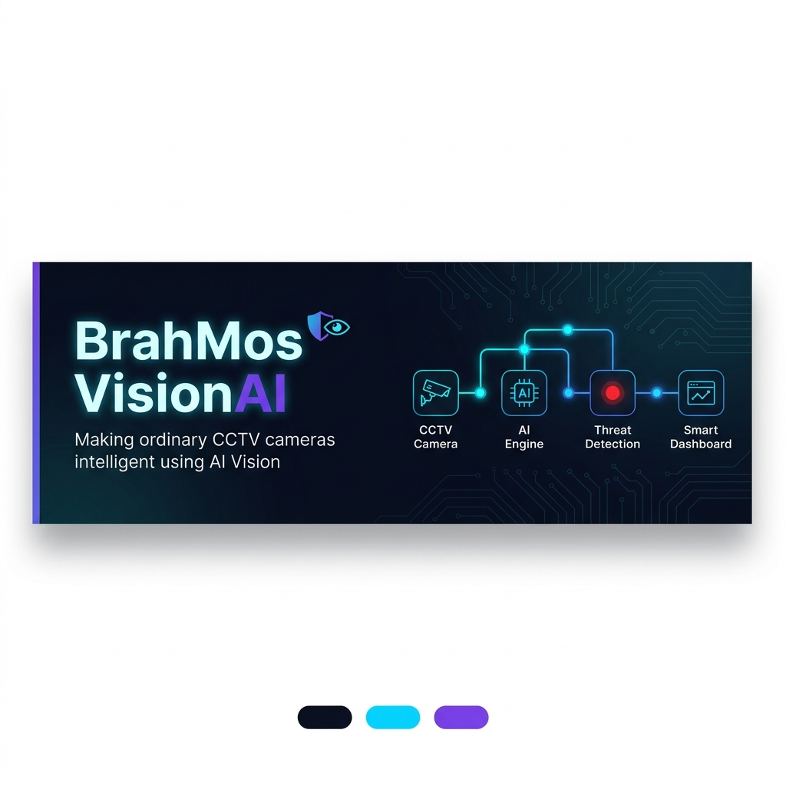

<div align="center">



# 🎥 BrahMos VisionAI

### Transform Any CCTV Camera into an AI-Powered Smart Surveillance System 🚀

> *"Making ordinary CCTV cameras intelligent using AI Vision."*

[](LICENSE)
[](https://www.python.org/)
[](https://react.dev/)
[](https://fastapi.tiangolo.com/)
[](https://docs.ultralytics.com/)
[](https://github.com/vishesh-017/brahmos-visionai)

</div>

---

BrahMos VisionAI is an intelligent video analytics platform that uses AI and Computer Vision to analyze CCTV footage in real-time. It goes beyond simple recording — it **detects, understands, thinks, decides, and acts** on security events autonomously.

---

## ✨ Features

🔹 **Real-Time Object Detection** — Instant YOLO-powered detection at 30fps  
🔹 **Person & Vehicle Detection** — Classify and track humans, cars, bikes & more  
🔹 **Suspicious Activity Monitoring** — Contextual AI reasoning beyond bounding boxes  
🔹 **AI Based Security Alerts** — Dynamic risk scoring (LOW / MEDIUM / HIGH)  
🔹 **Multiple CCTV Stream Support** — Monitor several camera feeds simultaneously  
🔹 **Smart Dashboard** — Live analytics, event timeline, and real-time insights  
🔹 **Video Evidence Management** — Forensic PDF report generation on demand  
🔹 **Natural Language Query** — Ask questions like *"Who entered the restricted zone today?"*

---

## 🧠 Powered By

| Layer | Technology |
|---|---|
| 🎯 Detection | YOLO Object Detection (ONNX) |
| 👁️ Vision | OpenCV |
| 🐍 Backend | Python 3.10+, FastAPI |
| ⚛️ Frontend | React.js (Vite + TypeScript) |
| 🤖 AI Reasoning | Local LLMs / Gemini Vision Models |
| 🔌 Real-time | WebSockets (30fps inference stream) |

---

## 🗂️ Project Structure

```
BrahMos-VisionAI
│
├── backend/          # Python FastAPI server, ONNX inference, AI reasoning
├── frontend/         # React + TypeScript dashboard
├── docs/             # Architecture diagrams and documentation
├── screenshots/      # UI previews and demo images
├── models/           # ONNX model weights (auto-generated, not tracked by git)
├── assets/           # Logos, banner images
├── README.md
├── CONTRIBUTING.md
└── LICENSE
```

---

## 🚀 Quick Start

### Prerequisites
- Python 3.10+
- Node.js 18+
- npm or yarn

### 1. Backend Setup

```bash
cd backend
pip install -r requirements.txt
```

**Export the AI Model (YOLO → ONNX):**
```bash
python export_onnx.py
```

**Start the Server:**
```bash
python main.py
```
> Backend runs on `http://localhost:8000`

---

### 2. Frontend Setup

```bash
cd frontend
npm install
npm run dev
```
> Dashboard available at `http://localhost:5173`

---

## 🏗️ Architecture

```
CCTV Camera
     ↓
 AI Engine (YOLOv8 ONNX + OpenCV)
     ↓
 Threat Detection & Risk Scoring
     ↓
 Smart Dashboard (React)
```

- **Backend:** Python, FastAPI, OpenCV, ONNXRuntime, SQLite, ReportLab  
- **Frontend:** React, Vite, TypeScript, Framer Motion, Lucide React  
- **Communication:** WebSockets (real-time) + REST APIs (historical data & reports)

---

## 📸 Screenshots

> Screenshots are available in the [`screenshots/`](screenshots/) directory.

---

## 🤝 Contributing

We welcome contributions! Please read [CONTRIBUTING.md](CONTRIBUTING.md) before submitting a pull request.

---

## ⚖️ License

This project is licensed under the **GNU Affero General Public License v3.0 (AGPL-3.0)**.  
See the [LICENSE](LICENSE) file for full details.

---

<div align="center">

*Open-source AI brain for CCTV surveillance.*  
**Built for the future of intelligent physical security.** 🛡️

</div>
