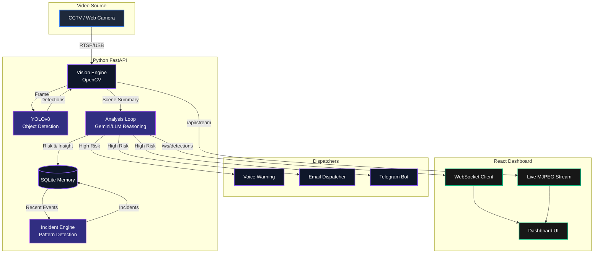

# 🏗️ BrahMos VisionAI Architecture

This document outlines the core architecture and data flow of the BrahMos VisionAI platform.

## System Overview Diagram

---

## Component Breakdown

### 1. Vision Engine (`vision_engine.py`)
Responsible for connecting to the camera, reading frames via OpenCV, and running the `brahmos_vision_model.onnx` (YOLO) model for raw object detection. It runs in a dedicated background thread (`_vision_loop`).

### 2. Analysis Engine (`main.py` -> `_analysis_loop`)
Runs periodically (e.g., every 3 seconds). It takes the raw detections (e.g., "3 Persons", "1 Car") and runs **Agentic AI Reasoning** using local LLMs or Gemini Vision. This layer assigns a dynamic **Risk Score (LOW, MEDIUM, HIGH)** based on the scene context.

### 3. Incident Engine (`incident_engine.py`)
Runs every 30 seconds. It looks at the recent history in the database (Memory) and detects larger patterns. For example, if it sees "Medium Risk: Person loitering" 5 times in the last hour, it creates a new "Suspicious Pattern Incident".

### 4. Dispatchers (`main.py`)
Background daemon threads that wait in queues to send alerts:
- **Voice Loop:** Plays an audible siren and speaks the warning via TTS.
- **Email Loop:** Sends urgent email reports via SMTP.
- **Telegram Loop:** Sends push notifications to a Telegram chat.

### 5. WebSocket Server
Pushes the real-time AI reasoning and bounding box coordinates to the React frontend at ~30 FPS, keeping the dashboard live without constant HTTP polling.
