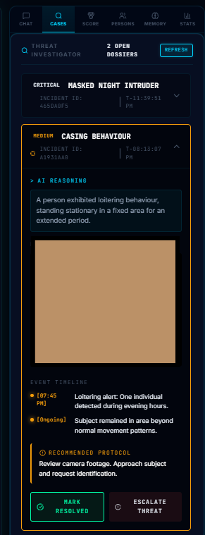
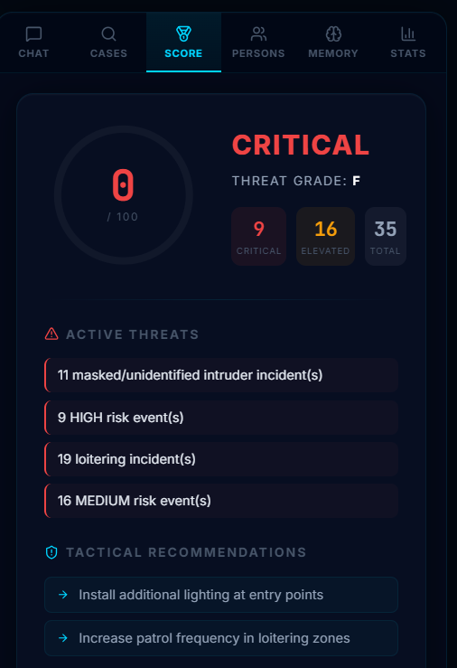
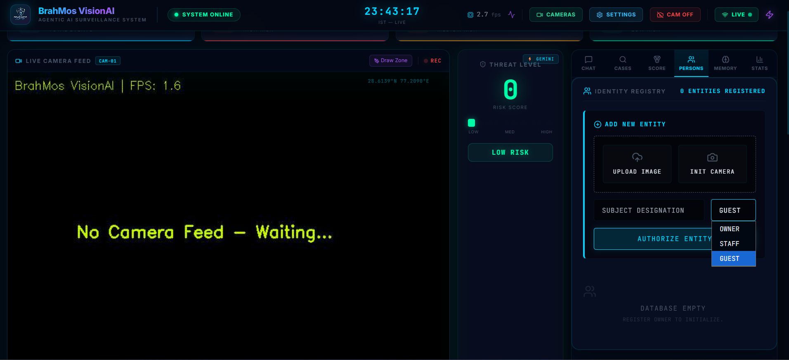
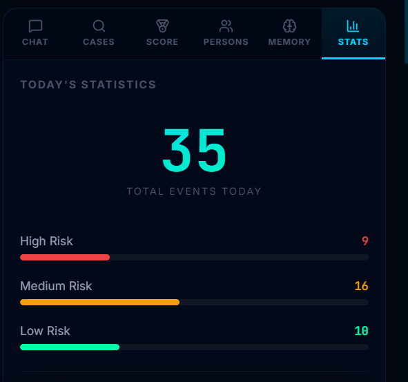
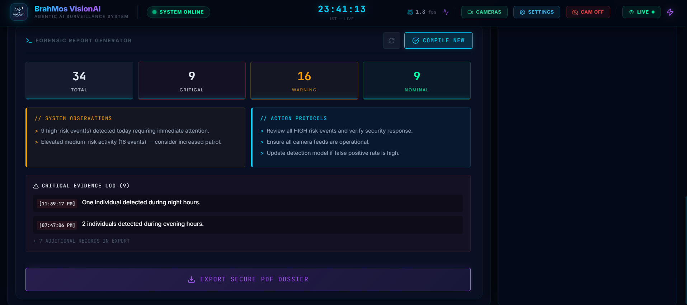
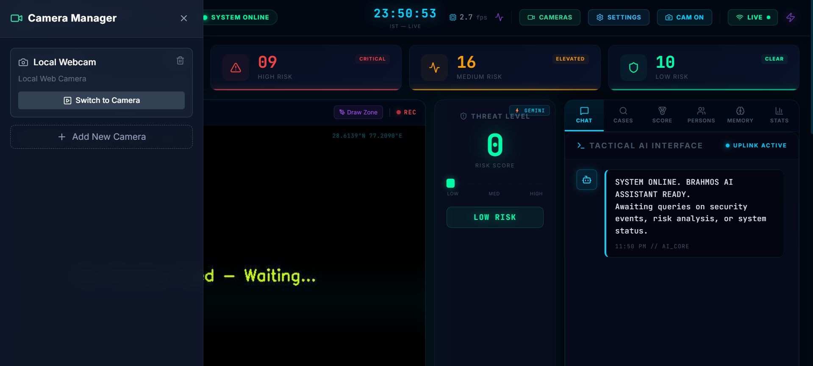
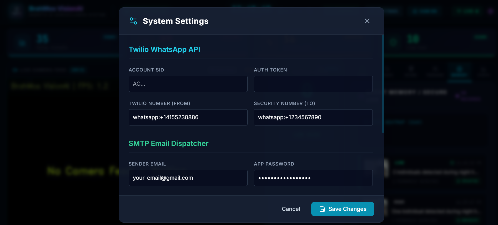

# 📸 Screenshots

Here is a visual preview of the BrahMos VisionAI system in action.

## 1. Live Surveillance Dashboard
Shows the real-time camera feed with YOLO bounding boxes and the live event stream on the right.

## 2. Incident Case Investigator
Deep analysis and timeline tracking of anomalous behaviour detected by the AI.

## 3. Security Score Dashboard
A real-time evaluation of the security posture, risk thresholds, and recent threats.

## 4. Identity Registry
The facial recognition enrollment portal allowing seamless registration of new subjects with restricted zone clearance controls.

## 5. System Statistics
Live performance metrics tracking detections, event processing, and engine framerates.

## 6. Forensic Report Generation
Generate comprehensive, downloadable PDF reports summarizing daily security events and risks.

## 7. Multi-Camera Manager
Switch between different RTSP streams, IP cameras, and local webcams effortlessly.

## 8. System Settings
Configure WhatsApp Twilio alerts, Email SMTP, and Gemini API keys directly from the UI.

